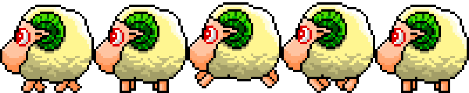
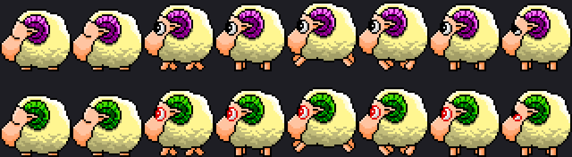
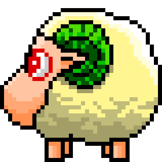

<meta charset="UTF-8">

# STRAY SHEEP The Screen Mate (Scmpoo)



**This is not a game.** It is a classic Windows **screen mate** (desktop companion / digital pet): Poe wanders on top of your desktop, reacts to windows, and plays short animations. There is no score, levels, or win condition.

_STRAY SHEEP The Screen Mate_ (Japanese: STRAY SHEEP スクリーンメイト) is based on Fuji TV's multimedia project _STRAY SHEEP_ (Japanese: ストレイシープ), with character animations from _The Adventure of STRAY SHEEP_ (1994), featuring Poe, Merry, and the alien Hue.

## Where this code comes from

The reconstructed C source and modern Windows port come from **[lwu309/Scmpoo](https://github.com/lwu309/Scmpoo)** — a reverse-engineering project that rebuilt the original 16-bit New Executable for 32/64-bit Windows.

This repository is a **fork of that work**. On top of it we:

- translated the UI / strings to English
- added an **alien sheep** mode approximated **from memory** of an older / alternate Scmpoo behaviour that was not present in the recovered stock bitmaps

Please star and credit the upstream project: [https://github.com/lwu309/Scmpoo](https://github.com/lwu309/Scmpoo)

---

## Alien sheep mode — recreated from memory

Some older builds were remembered as having a rarer “alien” Poe: **green horns**, **red eyes**, a distinct UFO abduction, then an aggressive spell on the desktop. The publicly recovered EXE only shipped the normal purple-horn sheep sheets.

This fork rebuilds that remembered behaviour from memory and the existing screen-mate logic — not from a dumped alien-mode binary:

1. **Sprites** — sheets `101`–`111` recolored to `112`–`122` (green horns + red pupils) via `tools/generate_alien_sheep_bmp.py`
2. **Sequence** — red UFO beam abduction → gravity fall → landing pose → temporary alien overlay on the **normal** screen-mate AI (walk, climb, windows, taskbar, drag)
3. **Aggression** — faster chase of other instances, knock into roll; victims sometimes panic-flee
4. **Rarity** — same special-action table as other UFO events



*Top: stock Poe · Bottom: alien recolor (green horns / red eyes)*




*Landing poses on impact after the alien drop (handstand-sheet cells 4 and 6)*

### Trying alien mode

- Wait for special actions (same rarity class as other UFO scenes), or  
- **Ctrl+Shift+double-click** Poe → debug dialog → **Alien**

Run several instances to see chase / knock / flee against normal sheep.

---

## Usage

Poe appears on the desktop and usually walks or runs. Some actions play his voice. Special actions (UFOs, alien abduction, etc.) are rarer.

He reacts to visible windows (collisions, landing on top edges when gravity is on). Up to 9 instances can run at once.

- **Drag** with left/right mouse to move him
- **Drop a file** on him to “eat” it (`.wav` plays)
- **Left double-click** — settings (admin may be needed on Vista+ to write the `.ini`)
- **Right double-click** — exit
- **Ctrl+Shift+left double-click** — debug action picker

## Build from source

CMake ≥ 3.16. Visual Studio or MinGW:

```bash
cmake -S . -B cmake-build-debug
cmake --build cmake-build-debug
```

## Copyright information and credits

**Upstream RE / source:** [lwu309/Scmpoo](https://github.com/lwu309/Scmpoo)

Original codebase owned by Village Center, Inc. (defunct)

All character sprites in bitmap images owned by Fuji Television Network, Inc. and Robot Communications Inc.

Artwork: NOMURA Tatsutoshi (Robot)

Producer: SAITŌ Akimi (Fuji TV)

Poe's voice: HARA Masumi

This fork’s alien sheets are palette/recolor derivatives of those sprites, added to approximate a remembered older variant — not an official Fuji TV / Village Center release.
